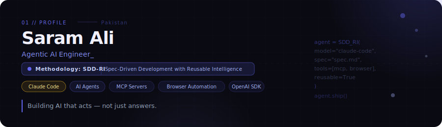

<!-- BANNER -->

  

 

<!-- PROFILE VIEWS -->

---

<!-- TYPING HEADER -->

---

## 🧠 Who Am I?

Hey — I'm **Saram Ali** from Rawalpindi, Pakistan 🇵🇰

I've been writing code for **5 years**, and for the past few of those I've gone deep into one specific problem:

> **How do you build AI agents that are reliable, testable, and actually ship to production?**

My answer is **SDD-RI** — *Spec-Driven Development with Reusable Intelligence*. Instead of jumping into syntax, I write a spec first. Then I let the AI (Claude Code, OpenAI SDK) do the heavy lifting. The result? Systems that are governed, measurable, and built to last — not just demos.

**What I do every day:**
- 🤖 Design and build autonomous AI agents with tool use, memory, and browser access
- 📋 Write architecture specs before writing a single line of code
- 🔗 Build custom MCP Servers that connect AI to real-world APIs and services
- 🌍 Contribute to open source AI projects and share what I learn
- 🧑‍🏫 Mentor other developers getting into agentic AI

**Where I'm headed:** I'm actively building toward launching my own **AI-native product/startup** — something built spec-first, shipped with agents, and designed to solve a real problem.

---

## 🚀 Featured Projects

### 📖 [AI Native Book](https://github.com/SARAMALI15792/AINativeBook)
> A book co-authored by humans and AI agents — built using SDD-RI methodology.

An open-source project exploring what it means to build *AI-native* software from the ground up. Written spec-first, with agents contributing to content generation, structure, and iteration.

**Stack:** `Claude Code` · `SDD-RI` · `Python` · `Markdown` · `AI Agents`

---

### 🔗 [LinkedIn MCP Custom Server](https://github.com/SARAMALI15792/Linkedin_mcp_custom_server)
> A custom Model Context Protocol server that connects AI agents to LinkedIn.

Built from scratch using the MCP spec — allows Claude and other LLMs to interact with LinkedIn data through a governed, structured tool interface. A practical example of agentic API design.

**Stack:** `MCP Server` · `Python` · `FastAPI` · `OAuth` · `Claude Code`

---

### 👟 [Sneakora Tech](https://github.com/SARAMALI15792/Sneakora_tec)
> An AI-powered sneaker discovery and automation platform.

Combines LLM-driven product discovery with automated web workflows. Agents search, filter, and surface deals autonomously — a real-world showcase of browser-integrated agentic AI.

**Stack:** `Python` · `FastAPI` · `Playwright` · `OpenAI SDK` · `AI Agents`

---

## 💻 Tech Stack

### 🤖 AI & Agentic

### 🐍 Languages

### 🔧 Backend & APIs

### 🌐 Automation & Web

### 🗄️ Data & Storage

### 🛠️ Tools

---

## 📊 GitHub Stats

---

## 🐍 Contribution Snake

  

---

## 🔝 Top Contributed Repos

---

## 🌱 Open Source Philosophy

I believe the best way to learn agentic AI is to **build in public**.

Every project I ship follows three rules:

1. **Spec first** — no code before the architecture is clear
2. **Agents do the work** — Claude Code and OpenAI SDK handle implementation
3. **Everything is testable** — if it can't be measured, it won't scale

> Watch my repos — I push experiments and agents frequently. ⭐ the ones you find useful.

---

## 🌐 Connect

---

*✍️ Dev Quote of the Day*

---

**🤖 Spec first. Ship with agents. Build what matters.**

